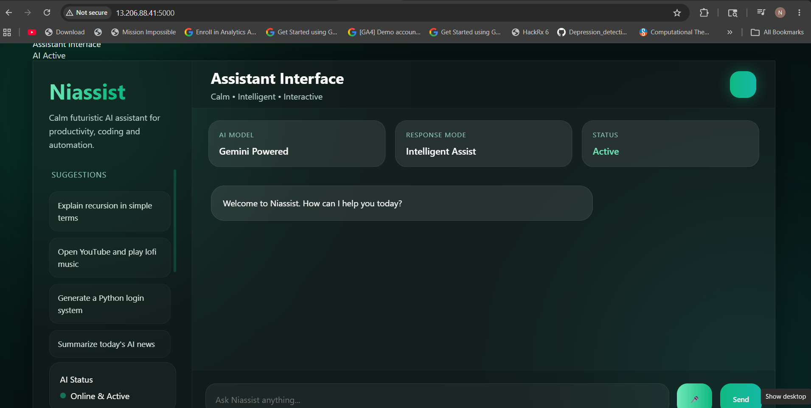
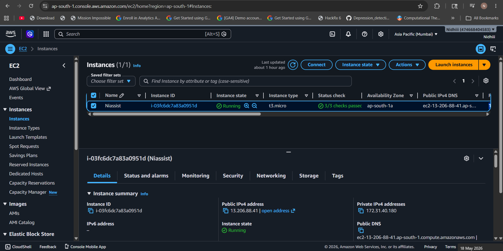
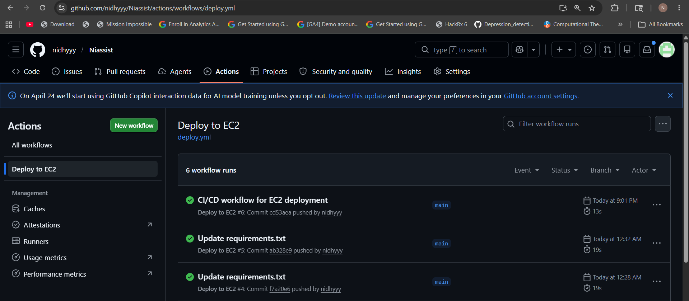
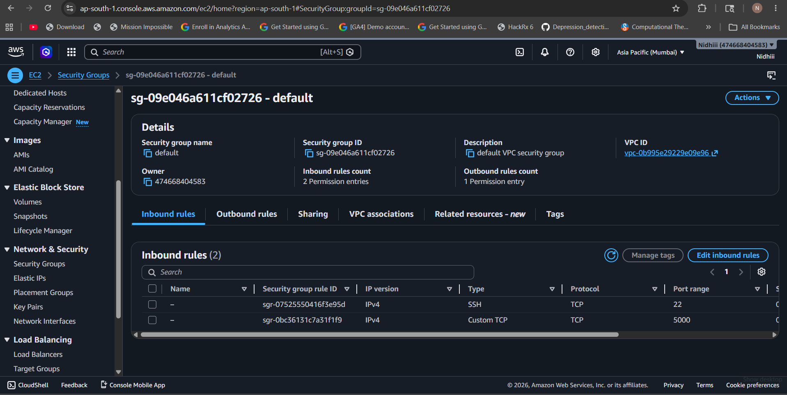

# Niassist

Modern AI-powered assistant deployed on AWS EC2 with CI/CD automation.

## Live Demo
[Visit Niassist](http://13.206.88.41)

---

## Project Overview
Niassist is an AI-powered assistant web application deployed on AWS EC2 using Flask, Gunicorn, Nginx, and GitHub Actions CI/CD.

The project supports intelligent responses, voice input, and a modern futuristic user interface.

---

## Features
- AI Assistant Interface
- Voice Command Support
- Intelligent Query Responses
- Responsive UI Design
- Cloud Deployment on AWS EC2
- CI/CD Automation using GitHub Actions
- Production Deployment using Gunicorn 

---

## Technologies Used

### Frontend
- HTML
- CSS
- JavaScript

### Backend
- Python
- Flask

### Cloud & Deployment
- AWS EC2
- Nginx
- Gunicorn
- GitHub Actions

---

## Deployment Architecture

Browser → Nginx → Gunicorn → Flask → AWS EC2

---

## Screenshots

### Live Website


### EC2 Instance


### GitHub Actions CI/CD


### Security Group


---

## Installation & Setup

### Clone Repository

```bash
git clone https://github.com/nidhyyy/Niassist.git
cd Niassist
```

### Create Virtual Environment

```bash
python -m venv venv
```

### Activate Virtual Environment

#### Windows

```bash
venv\Scripts\activate
```

#### Linux/Mac

```bash
source venv/bin/activate
```

### Install Dependencies

```bash
pip install -r requirements.txt
```

### Run Application

```bash
python app.py
```
